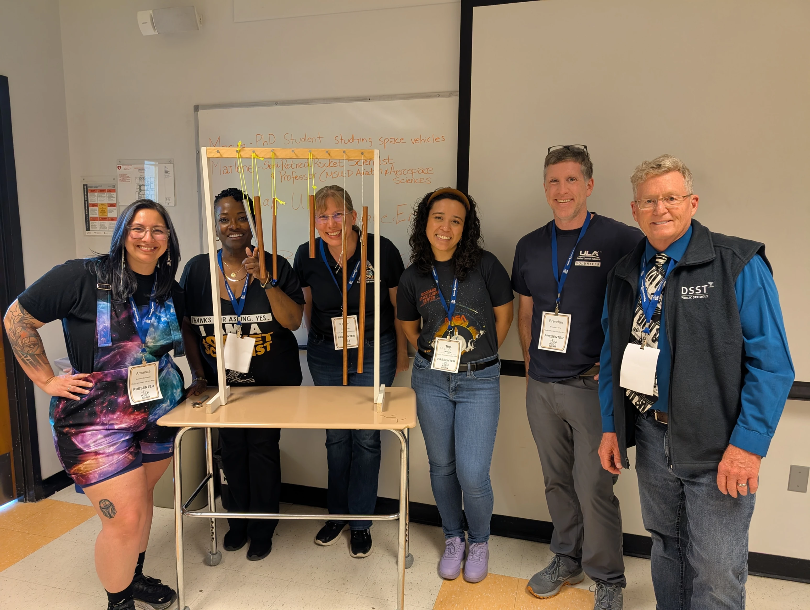

I volunteered with the Rocky Mountain section of AIAA at the Girls Exploring STEM (GESTEM) event! We hosted a workshop titled "Good Vibrations": an acoustics-based activity where students learned about the physics of sound through wind chimes. It was awesome to connect with other members of AIAA while giving back to the Denver community!

